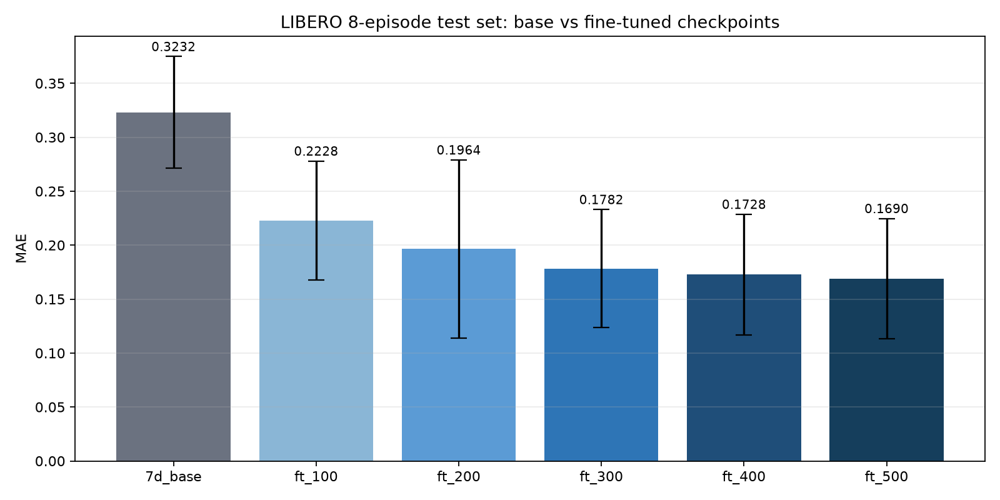
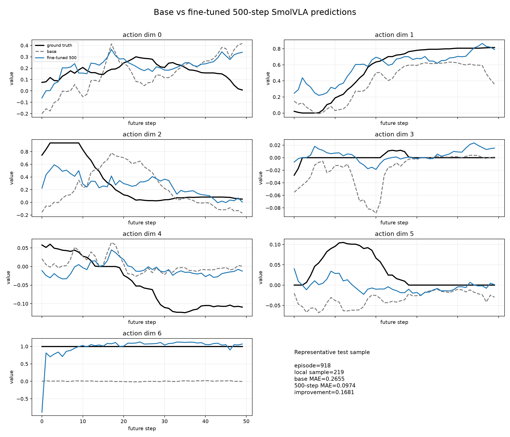
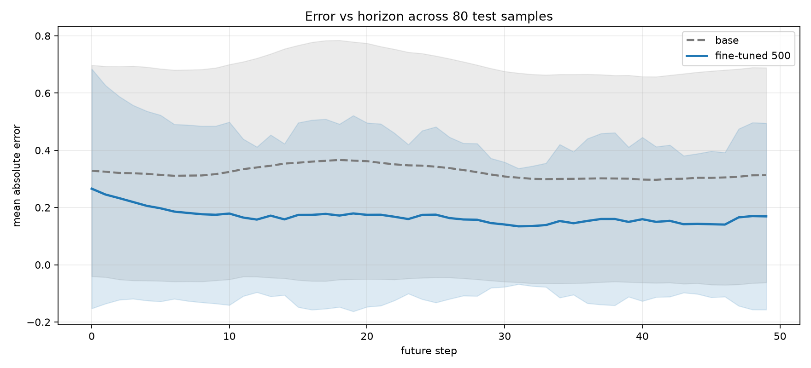

# SmolVLA ActionLens 500 步微调模型

这是基于 LeRobot 微调得到的 7 维 SmolVLA 策略，训练任务为 LIBERO：

> 拿起巧克力布丁并放入篮子

模型从 `bicmol/smolvla-libero` 出发，使用 12 个训练 episode 微调 500 个优化步。每次推理输出未来 50 步、每步 7 维的动作序列。

## 输入与输出

```text
输入：
  observation.images.image
  observation.images.wrist_image
  observation.state [8]
  自然语言任务指令

输出：
  action [50, 7]
```

LIBERO 数据集需要将相机键重命名：

```text
observation.images.image2 -> observation.images.wrist_image
```

## 离线评估

测试集：8 个测试 episode，每个 episode 抽取 10 帧，共 80 个样本。

| 模型 | MAE | 相对基础模型 |
|---|---:|---:|
| 7D 基础模型 | 0.3232 | - |
| 100 步 | 0.2228 | 降低 31.1% |
| 200 步 | 0.1964 | 降低 39.2% |
| 300 步 | 0.1782 | 降低 44.9% |
| 400 步 | 0.1728 | 降低 46.5% |
| 500 步 | 0.1690 | 降低 47.7% |



## 预测曲线对比





## 训练配置

```text
数据集：lerobot/libero
任务：拿起巧克力布丁并放入篮子
训练 episode：12 个
测试 episode：8 个
Batch size：1
梯度累积：8
有效 batch size：8
优化步数：500
动作预测长度：50
数据帧率：10 FPS
精度：bfloat16
硬件：RTX 4060 Laptop 8 GB
```

## 使用方式

安装 LeRobot 和 SmolVLA 依赖后加载模型：

```python
from lerobot.policies.smolvla import SmolVLAPolicy

policy = SmolVLAPolicy.from_pretrained(
    "liming662/smolvla-actionlens-finetuned-500"
)
```

## 局限说明

当前指标是离线动作预测 MAE，不是 LIBERO 闭环任务成功率。结果仅基于单一抓放任务和较小的测试 episode 子集。
